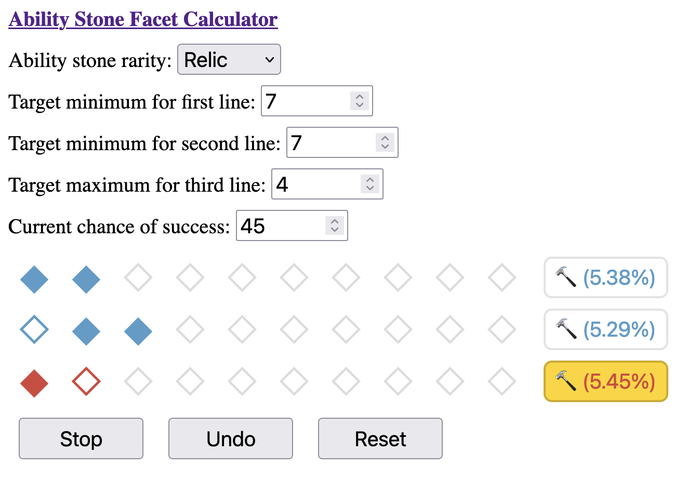

# facet

Click [here][ui] for the web interface!

Given a [Lost Ark][la] [ability stone][as], this project calculates the optimal
sequence of moves to maximize the probability of hitting your target rolls.

This repository contains:

1. A library containing the [expectimax][em]-based solver.
2. A [web interface][ui] for the solver (compiled to WebAssembly).
3. A basic command-line interface for the solver.

# Example



- This is a **Relic** tier ability stone, with ten slots per line.
- The goal is to hit **>= 7**,**>= 7**, and **<= 4** for each line, respectively.
- The current success rate is **45%**.

The best choice--line three--is highlighted in gold, which will give us a
**5.45%** overall chance of reaching our targets if we make optimal moves.
Clicking this button will allow us to record what actually happened in game:


Assuming we got lucky, we see that probability of reaching our targets increases:


# Theory

This solver takes ideas from the [expectiminimax][em] algorithm, which the
simplification that there are no opponent actions to minimize. The problem
can also be described as a [Markov decision process][md], although I'm not
at all familiar with those.

This is essentially a brute-force evaluation of the probability of all
possible states, along with the expected value of each state. Here is some
simplified pseudocode:

```python
def recurse(state):
  if state.is_terminal():
    return state.terminal_value()

  optimal = 0

  for line in range(0, 3):
    success = recurse(state.succeed(line)) * state.chance()
    failure = recurse(state.fail(line)) * (1 - state.chance())
    optimal = max(optimal, success + failure)

  return optimal
```

# Performance

The key idea to making the problem tractable is that the order of successes
and failures within a line do not matter, only the quantity. Each state can
be uniquely determined by:

- Current success rate (25, 35, ..., 75)
- Number of successes for each line (0, 1, ..., 6-10)
- Number of attempts for each line (0, 1, ..., 6-10)

This gives us an upper bound on the number of states we need to evaluate:

```text
      6 (# of distinct success rates)
   * 66 (# of valid success/attempt pairs per line: 1 [(0, 0)] + 2 [(0, 1), (1, 1)]  + ... + 11)
   ^  3 (# of independent lines)
-------
1724976
```

Which is well within brute-force range, and is small enough to cache all intermediate values.

We can also compute an upper bound on probability values, so we can use fixed-size
integers on the stack. First, we simplify fractions from [25/100, 35/100, ..., 75/100]
to [5/20, 7/20, ..., 15/20]. Note that we don't simplify further to [1/4, 7/20, ..., 3/4]
because keeping the same denominator makes computations simpler.

```text
20 (denominator) ^ 30 (maximum recursion depth)
  = (2 * 10) ^ 30
  < (2 * 2^4) ^ 30
  = (2 ^ 5) ^ 30
  = 2 ^ 150
```

So 192-bit integers from the [uint][ut] will suffice. Our only operations on
probabilities are:

1. Addition and multiplication at chance nodes to calculate expected value.
2. Comparison at choice nodes to select the maximum value.

Because all probability values at each level of recursion have the same
denominators, we can remove them from our calculations and divide at the end.

We also need terminal node values to maximize. I chose the [indicator function][if]
for whether the node has the desired minimum and maximum values per line.
Because these values are discrete, they're easy to compute accurately,
and because they multiply probability values by only 0 or 1, the maximum
values we're working with are still bounded by 2^150 (as per above).
Other choices of values could be interesting to explore, like the expected
number of successes per line, but would require more work.

We could achieve effectively constant runtime by persisting the cache across
runs, but the cache is a little too large to deliver over the network, would
be less flexible than on-the-fly computation, and doesn't matter as much if
the runtime is already short enough to be interactive. But for what it's worth,
states can be totally ordered, and so a dense cache representation wouldn't
need to store states at all--just the associated data in correct order.
If you were only interested in the optimal decision at each state, you could
fit it into two bits and have a 500kb cache.

Thanks to [@lukeshimanuki][ls], [@czlwang][cw], and H. Wang for discussion.

[as]: https://lostark.wiki.fextralife.com/Ability+Stones
[cw]: https://github.com/czlwang
[em]: https://en.wikipedia.org/wiki/Expectiminimax
[if]: https://en.wikipedia.org/wiki/Indicator_function
[la]: https://www.playlostark.com
[ls]: https://github.com/lukeshimanuki
[md]: https://en.wikipedia.org/wiki/Markov_decision_process
[ui]: https://nwtnni.github.io/facet/
[ut]: https://crates.io/crates/uint
